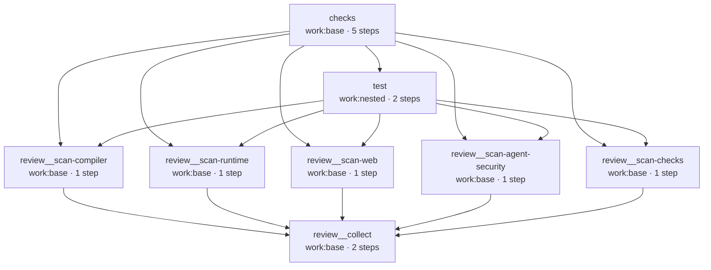

# Dogfooding: the engine checks itself

work is built with work. The repository ships a `.workflows/ci.yaml`
that runs the project's own checks, tests, and an agent code review — every job in
its own micro-VM, on the same engine you run.

It is a useful example precisely because it is real. Nothing here is a toy: the
pipeline exercises the features you'd reach for in your own workflows — reusable
workflows, a `needs` DAG that threads outputs between jobs, parallel fan-out, and
AI agent steps running inside the sandbox. The `test` job goes one step further and
runs the engine's **own e2e suite in nested micro-VMs** — so `work` tests its VM
layer with `work`, on one machine, no external CI (see [test](#test-the-suite-runs-itself-nested)).

```bash
work run ci          # the whole pipeline, headless
work --web           # or watch it run in the console
```

## The pipeline at a glance

`ci` is a thin orchestrator. It composes three **reusable workflows** with
job-level `uses:`, and the `needs` between them sequences the run:

```yaml
# .workflows/ci.yaml
name: ci
jobs:
  checks:
    uses: workflow/checks
  test:
    needs: [checks]
    uses: workflow/test
  review:
    needs: [checks, test]   # review inherits both — see "review", below
    uses: workflow/review
```

At compile time each call is inlined into one flat DAG, so a single `work run ci`
expands to the graph below — the actual output of `work graph ci --format mermaid`.
Every box is a real job in its own gondolin micro-VM; the `review__*` names are the
reusable `review` workflow's jobs after inlining:



The four `scan-*` source reviewers and `scan-checks` each depend on **both**
`checks` and `test` (they read the tooling output), then `collect` fans them back
in. Note `test` runs on `work:nested` — the [self-hosted nested run](#test-the-suite-runs-itself-nested).

## checks: run the tools, keep the output

`checks` runs the project's own static tooling — `lint`, `typecheck`, `knip`, and
`fan-in`. Each tool is its own step marked
[`continue-on-error`](../reference/workflow-syntax#steps): a failing tool doesn't
fail the job, so its output becomes data the rest of the pipeline can read (pass
or fail) while the run carries on. The step's real outcome still shows in the run.

Forwarding a tool's output is a one-liner: the engine already captures every
step's combined stdout+stderr, exposed as
[`steps.<id>.logs`](../reference/workflow-syntax#step-context). No `$WORK_OUTPUT`
plumbing — the step is just `run: npm run lint`.

```yaml
# .workflows/checks.yaml
name: checks
on:
  workflow_call:
    outputs:
      lint: ${{ jobs.static.outputs.lint }}
      # …typecheck / knip / fanin likewise
jobs:
  static:
    outputs:
      lint: ${{ steps.lint.logs }}       # the step's captured combined output
      # …typecheck / knip / fanin likewise
    steps:
      - name: install
        run: npm ci
      - id: lint
        name: lint
        continue-on-error: true          # a lint failure doesn't fail the job
        run: npm run lint
      # …typecheck / knip / fan-in are identical, one step each
```

::: info The build gate lives elsewhere
Because the dogfood tool steps are `continue-on-error`, `work run ci` does not
fail on a lint or test error — the signal is carried into the review. The
repository's actual gate is GitHub Actions (`.github/workflows/ci.yml`), which
runs the same tools directly and fails the build. The dogfood pipeline is a
demonstration, not the gate.
:::

## test: the suite runs itself, nested

`test` is the most pointed piece of dogfooding: it runs the **entire** test suite —
including the real-VM e2e tier — **self-hosted**. The job runs on `work:nested` (a
custom image that is just `work:base` plus `qemu-system-aarch64` and `qemu-img`), and
its `npm test` step boots the e2e examples in **nested gondolin micro-VMs**.

No special engine support is needed for the nesting. Inside a guest there is no
`/dev/kvm`, so gondolin's accelerator selection falls back to **TCG** (software
emulation) on its own. The inner VMs fetch their guest image once over the job's
egress and reuse it for the whole run. So `work` exercises its own VM layer
end-to-end — compile → boot → run a job in a VM — on one machine, no external CI:

```yaml
# .workflows/test.yaml
jobs:
  unit:
    runs-on: work:nested
    machine: { cpus: 8, memory: "64G" }   # the outer VM hosts the nested e2e VMs
    outputs:
      test: ${{ steps.test.logs }}
    steps:
      - run: npm ci
      - id: test
        continue-on-error: true            # keep the job green so review still sees it
        env: { WORK_SKIP_VM: "", WORK_NESTED: "1" }
        run: npm test
```

::: info Two honest caveats
- **It needs a roomy host.** The outer VM is sized to hold several 8 GB inner VMs
  at once (≈ 64 GB). Shrink the outer `machine:` and override the inner examples to
  smaller sizes to run on leaner hardware (at the cost of inner parallelism).
- **Two egress assertions skip when nested** (`WORK_NESTED=1`). The inner and outer
  VMs share gondolin's `192.168.127.0/24` guest subnet, so the egress test's on-box
  "model host" address collides between the layers. The secret-isolation contract
  is still verified on bare metal (host + GitHub Actions), and the core half — *the
  real key never enters the guest* — still runs nested.
:::

## review: five agents fan out, one fans them in

`review` is where the agent steps come in. Five reviewers run **in parallel**, each a
real [Pi](https://www.npmjs.com/package/@earendil-works/pi-coding-agent) agent in its
own micro-VM (`uses: work/agent`). Four read a single source subsystem from the
checkout; the fifth, `scan-checks`, reads the tooling output that `checks` and `test`
already produced — no re-running.

That output flows in **explicitly**. `review` declares `inputs:` for the tooling
results, and the caller (`ci.yaml`) passes them via `with:`, mapping the
`checks`/`test` job outputs onto those inputs — so the data flow is visible right
at the call site, and `review` itself references only `inputs.*`:

```yaml
# .workflows/ci.yaml  (excerpt)
  review:
    needs: [checks, test]
    uses: workflow/review
    with:
      lint: ${{ needs.checks.outputs.lint }}    # runtime value → review's inputs.lint
      typecheck: ${{ needs.checks.outputs.typecheck }}
      test: ${{ needs.test.outputs.test }}      # …and so on

# .workflows/review.yaml  (excerpt)
inputs:
  lint: { type: string, default: "" }           # self-contained; default for standalone runs
  typecheck: { type: string, default: "" }
  test: { type: string, default: "" }
jobs:
  scan-checks:
    machine: small
    outputs:
      findings: ${{ steps.r.outputs.output }}
    steps:
      - id: r
        uses: work/agent
        with:
          prompt: |
            Review this project's tooling output and report what matters.
            === lint ===      ${{ inputs.lint }}
            === typecheck === ${{ inputs.typecheck }}
            === test ===      ${{ inputs.test }}

  collect:
    needs: [scan-compiler, scan-runtime, scan-web, scan-agent-security, scan-checks]
    steps:
      - id: editor
        uses: work/agent
        with:
          prompt: |
            You are the review editor. De-duplicate findings across reviewers,
            drop low-confidence ones, rank by severity, and keep the top few.
            === compiler ===  ${{ needs.scan-compiler.outputs.findings }}
            # …the other four reviewers
      - name: show review
        env: { REVIEW: "${{ steps.editor.outputs.output }}" }
        run: printf '%s\n' "$REVIEW"
```

Each reviewer exposes its findings as a job output. `collect` is the editor: it
`needs` all five, then a final agent **verifies each candidate against the
checkout** (it has the full source tree in its own sandbox), de-duplicates the
overlap, drops what doesn't hold up, ranks by severity, and caps the result —
emitting a machine-readable JSON review instead of five raw piles. Each
reviewer reads its subsystem's source directly from the checkout — the whole
workspace is in its sandbox — which makes the pipeline usable as an automated
review loop (an agent can run `work run ci`, parse the JSON findings, fix, and
re-run).

::: tip The model key never enters the guest
Each agent reaches the model only through the sandbox's mediated egress: the egress
resolver allowlists the model host and injects the API key host-side, so the key
never lands inside the micro-VM. See [Agent steps](../guide/agent-steps).
:::

## What it exercises

Every part of the pipeline maps to a feature you can use directly:

| In the pipeline | Engine feature it leans on |
|---|---|
| `ci` calls `checks` / `test` / `review` with `uses: workflow/<name>` | [Reusable workflows](../guide/reusable-workflows) — a job calls a whole workflow |
| `test` runs the full suite in nested gondolin VMs | [Custom images](../guide/custom-images) (`work:nested` bundles QEMU) + nested execution — TCG fallback, no `/dev/kvm` needed |
| `checks` / `test` expose tool output as `workflow_call` outputs | Job and workflow outputs threaded across the `needs` DAG |
| `ci` passes `checks`/`test` outputs into `review` via `with:` | Runtime-valued reusable-workflow inputs — a `needs.*` value resolves at run inside the callee's `inputs.*` |
| Five `uses: work/agent` reviewers running real Pi | [Agent steps](../guide/agent-steps) — a model works inside the job's sandbox |
| Five reviewers in their own micro-VMs, at once | Per-job isolation and the `needs` DAG's parallelism |

## Run it yourself

The workflows live in
[`.workflows/`](https://github.com/nullbytelabs/work/tree/main/.workflows)
(`ci.yaml`, `checks.yaml`, `test.yaml`, `review.yaml`). The review jobs need a model
configured in `work.json`; everything else runs without one.

```bash
work graph ci        # render the compiled DAG without running it
work run ci          # run the whole thing
work run review      # just the agent review (standalone)
```

From here, the [Reusable workflows](../guide/reusable-workflows) guide covers `uses:`
and output threading, and [Agent steps](../guide/agent-steps) covers `work/agent` and
the sandboxed egress.
