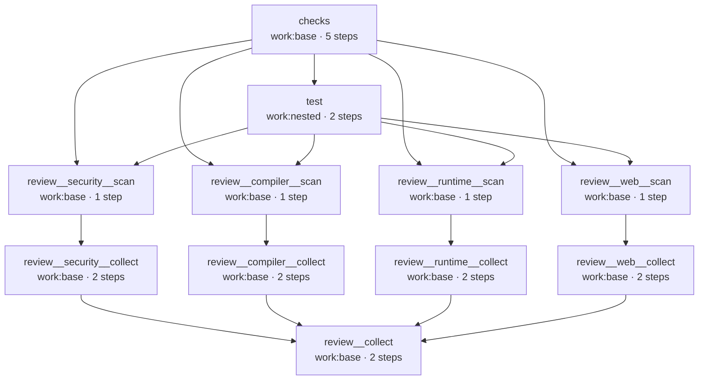

# Dogfooding: the engine checks itself

work is built with work. The repository ships a `.workflows/ci.yaml` that runs the
project's own checks, tests, and an agent code review, every job in its own
gondolin micro-VM, on the same engine you run.

It's a useful example precisely because it's real. The pipeline leans on the
features you'd reach for in your own workflows: reusable workflows (nested two
levels deep), a `needs` DAG that threads outputs between jobs, parallel fan-out,
and AI agent steps running inside the sandbox. The `test` job goes furthest: it runs
the engine's **own e2e suite in nested micro-VMs**, so `work` exercises its VM layer
with `work`, on one machine, no external CI (see [test](#test-the-suite-runs-itself-nested)).

```bash
work run ci          # the whole pipeline, headless
work serve           # or watch it run in the console
```

## The pipeline at a glance

`ci` is a thin orchestrator. It composes three **reusable workflows** with
job-level `uses:`, and the `needs` between them sequences the run:

```yaml
# .workflows/ci.yaml
name: ci
jobs:
  checks:
    uses: workflow/checks
  test:
    needs: [checks]
    uses: workflow/test
  review:
    needs: [checks, test]
    uses: workflow/review
    with:                                       # map the tool outcomes → review's inputs
      lint: ${{ needs.checks.outputs.lint }}
      typecheck: ${{ needs.checks.outputs.typecheck }}
      knip: ${{ needs.checks.outputs.knip }}
      fanin: ${{ needs.checks.outputs.fanin }}
      test: ${{ needs.test.outputs.test }}
```

`review` is itself composition: it fans out to **four focused subsystem reviews**
(`compiler-review`, `runtime-review`, `security-review`, `web-review`), each its own
reusable workflow. So a single `work run ci` inlines everything into one flat DAG,
the actual output of `work graph ci --format mermaid`. Every box is a real job in its
own micro-VM:



Read it in three bands. `checks` → `test` run first. Then each focused review is a
**scan → collect** pair (a reviewer reads one subsystem, a per-subsystem editor
verifies and caps it), and the four verified reviews fan into the top-level
`review__collect`, which merges them. The four `scan` jobs sit behind both `checks`
and `test` because `review` as a whole `needs` them; only the final `collect`
actually reads the tools' outcomes (threaded in as inputs, below).

## checks: run the tools, forward the verdict

`checks` runs the project's static tooling (`lint`, `typecheck`, `knip`, `fan-in`),
each as its own step marked
[`continue-on-error`](../reference/workflow-syntax#steps), after a single `npm ci`.
A failing tool doesn't fail the job; the run carries on so every tool's result still
reaches the review.

What it forwards is the **outcome**, not the log. Each step exposes the engine's
built-in per-step verdict (`success`/`failure`/`skipped`) via
[`steps.<id>.outcome`](../reference/workflow-syntax#step-context), and that's what
becomes the job output. No `$WORK_OUTPUT` plumbing, and no LLM in the loop for "did
it pass": the pass/fail signal is already authoritative. The failed step's own output
stays visible in the run for detail.

```yaml
# .workflows/checks.yaml
name: checks
on:
  workflow_call:
    outputs:
      lint: ${{ jobs.static.outputs.lint }}
      # …typecheck / knip / fanin likewise
jobs:
  static:
    outputs:
      lint: ${{ steps.lint.outcome }}        # the engine's pass/fail verdict
      # …typecheck / knip / fanin likewise
    steps:
      - name: install
        run: npm ci
      - id: lint
        name: lint
        continue-on-error: true              # a lint failure doesn't fail the job
        run: npm run lint
      # …typecheck / knip / fan-in are identical, one step each
```

::: info The build gate lives elsewhere
Because the tool steps are `continue-on-error`, `work run ci` doesn't fail on a lint
or test error — the signal is carried into the review instead. The repository's
actual gate is GitHub Actions (`.github/workflows/ci.yml`), which runs the same tools
directly and fails the build. The dogfood pipeline is a demonstration, not the gate.
:::

## test: the suite runs itself, nested

`test` is the most pointed piece of dogfooding: it runs the **entire** test suite,
including the real-VM e2e tier, **self-hosted**. The job runs on `work:nested` (a
custom image that is just `work:base` plus `qemu-system-aarch64` and `qemu-img`), and
its `npm test` step boots the e2e examples in **nested gondolin micro-VMs**.

No special engine support is needed for the nesting. Inside a guest there's no
`/dev/kvm`, so gondolin's accelerator selection falls back to **TCG** (software
emulation) on its own. The inner VMs fetch their guest image once over the job's
egress and reuse it for the whole run. So `work` exercises its own VM layer
end-to-end (compile → boot → run a job in a VM) on one machine, no external CI:

```yaml
# .workflows/test.yaml
jobs:
  unit:
    runs-on: work:nested
    machine: { cpus: 8, memory: "64G" }   # the outer VM hosts the nested e2e VMs
    outputs:
      test: ${{ steps.test.outcome }}     # same deterministic verdict as checks
    steps:
      - run: npm ci
      - id: test
        continue-on-error: true            # keep the job green so review still sees the outcome
        env: { WORK_SKIP_VM: "", WORK_NESTED: "1" }
        run: npm test
```

::: info Two honest caveats
- **It needs a roomy host.** The outer VM is sized to hold several 8 GB inner VMs at
  once (≈ 64 GB). Shrink the outer `machine:` and override the inner examples to
  smaller sizes to run on leaner hardware (at the cost of inner parallelism).
- **Two egress assertions skip when nested** (`WORK_NESTED=1`). The inner and outer
  VMs share gondolin's `192.168.127.0/24` guest subnet, so the egress test's on-box
  "model host" address collides between the layers. The secret-isolation contract is
  still verified on bare metal (host + GitHub Actions), and the core half — *the real
  key never enters the guest* — still runs nested.
:::

## review: focused reviewers, verified then merged

`review` is where the agent steps come in, and where the pipeline shows off
nesting. Rather than one big reviewer, it's **pure composition** of four focused,
self-contained reusable workflows, one per subsystem:

| Focused review | Reads |
|---|---|
| `compiler-review` | `src/compiler/`, `src/spec/` |
| `runtime-review` | `src/runtime/`, `src/targets/` |
| `security-review` | the agent / egress / config surface |
| `web-review` | `src/web/`, `src/persistence/` |

Each one is a **scan → collect** pair. `scan` is a single
[Pi](https://www.npmjs.com/package/@earendil-works/pi-coding-agent) agent
(`uses: work/agent`) that reads its subsystem straight from the checkout. `collect`
is an editor agent that **verifies every candidate against the source**: it opens
each cited file, confirms the issue is real with a concrete failure scenario, drops
anything in `.review/accepted.md`, and caps the list to four, then emits
machine-readable JSON between scope-labeled sentinels:

```yaml
# .workflows/compiler-review.yaml  (the other three mirror it)
name: compiler-review
on:
  workflow_call:
    outputs:
      review: ${{ jobs.collect.outputs.review }}
jobs:
  scan:
    machine: small
    outputs:
      findings: ${{ steps.r.outputs.output }}
    steps:
      - id: r
        name: review compiler + spec
        uses: work/agent
        with:
          promptFile: .workflows/prompts/review-compiler.md
  collect:
    machine: small
    needs: [scan]
    steps:
      - id: editor
        uses: work/agent
        with:
          prompt: |
            …open each cited file, confirm the issue is real, drop what doesn't
            hold up, suppress anything in .review/accepted.md, cap at 4, emit JSON…
            === compiler + spec (raw reviewer output) ===
            ${{ needs.scan.outputs.findings }}
      - name: show review
        run: |
          printf '%s\n' "===== REVIEW JSON [compiler] BEGIN ====="
          # …$REVIEW… [compiler] END
```

Because each focused review verifies and caps on its own, it stays a small,
narrow-context job, and it runs standalone too (`work run compiler-review`) for a
fast, focused loop. The top-level `review.yaml` just wires the four together and adds
the merge editor:

```yaml
# .workflows/review.yaml  (excerpt)
inputs:                                   # deterministic tool outcomes from the caller
  lint: { type: string, default: "" }
  typecheck: { type: string, default: "" }
  test: { type: string, default: "" }
  # …knip / fanin likewise
jobs:
  security:  { uses: workflow/security-review }
  compiler:  { uses: workflow/compiler-review }
  runtime:   { uses: workflow/runtime-review }
  web:       { uses: workflow/web-review }
  collect:
    needs: [security, compiler, runtime, web]
    steps:
      - id: editor
        uses: work/agent
        with:
          prompt: |
            Merge the four pre-verified subsystem reviews — do NOT re-verify, only
            fold together: de-duplicate, rank by severity, keep at most 6. If any
            tooling outcome below is "failure", LEAD with it.
            === tooling status (success | failure | skipped) ===
            lint: ${{ inputs.lint }}   test: ${{ inputs.test }}   # …knip / typecheck / fanin
            === compiler === ${{ needs.compiler.outputs.review }}
            # …runtime / web / security
      - name: show review
        run: |
          # deterministic tooling banner (from the outcomes, not the model), then:
          printf '%s\n' "===== REVIEW JSON BEGIN ====="   # …END
```

The split is deliberate: **verification happens once, per subsystem, in the focused
collects**; the top-level editor only folds the four already-distilled reviews into
one, so it works over a handful of small JSON blocks, not raw scanner dumps.

The tooling outcomes ride in **explicitly**. `ci.yaml` maps the `checks`/`test` job
outcomes onto `review`'s declared `inputs:` via `with:`, so the data flow is visible
at the call site. The merge editor leads its summary with any `failure`, and the
`show review` step prints a deterministic tooling banner computed straight from the
outcomes, so a broken build is surfaced for certain, not left to the model's
discretion. There's no agent re-narrating logs; the failure detail already lives in
the `checks`/`test` step output in the run.

The final JSON (unlabeled `REVIEW JSON` sentinels) makes the pipeline usable as an
automated review loop: an agent can run `work run ci`, parse the findings, fix, and
re-run.

::: tip The model key never enters the guest
Each agent reaches the model only through the sandbox's mediated egress: the egress
resolver allowlists the model host and injects the API key host-side, so the key
never lands inside the micro-VM. See [Agent steps](../guide/agent-steps).
:::

## What it exercises

Every part of the pipeline maps to a feature you can use directly:

| In the pipeline | Engine feature it leans on |
|---|---|
| `ci` → `checks`/`test`/`review`, and `review` → four `*-review` reusables | [Reusable workflows](../guide/reusable-workflows) composed two levels deep |
| `test` runs the full suite in nested gondolin VMs | [Custom images](../guide/custom-images) (`work:nested` bundles QEMU) + nested execution — TCG fallback, no `/dev/kvm` needed |
| `checks`/`test` forward each tool's `steps.<id>.outcome` | Deterministic per-step verdict threaded as job/workflow outputs across the `needs` DAG |
| `ci` maps those outcomes into `review` via `with:` | Runtime-valued reusable-workflow inputs — a `needs.*` value resolves inside the callee's `inputs.*` |
| Nine `uses: work/agent` steps — four scan, four verify/cap, one merge | [Agent steps](../guide/agent-steps) — a real Pi model working in the job's sandbox |
| Each focused review verifies against its own checkout, in its own micro-VM | Per-job isolation and the `needs` DAG's parallelism |

## Run it yourself

The workflows live in
[`.workflows/`](https://github.com/nullbytelabs/work/tree/main/.workflows) —
`ci.yaml`, `checks.yaml`, `test.yaml`, `review.yaml`, and the four focused reviews
(`compiler-review.yaml`, `runtime-review.yaml`, `security-review.yaml`,
`web-review.yaml`), with their reviewer prompts under `.workflows/prompts/`. The
review jobs need a model configured in `work.json`; everything else runs without one.

```bash
work graph ci             # render the compiled DAG without running it
work run ci               # run the whole thing
work run review           # the four focused reviews + the merge, standalone
work run compiler-review  # just one subsystem (2 agent VMs)
```

From here, the [Reusable workflows](../guide/reusable-workflows) guide covers `uses:`
and output threading, and [Agent steps](../guide/agent-steps) covers `work/agent` and
the sandboxed egress.
