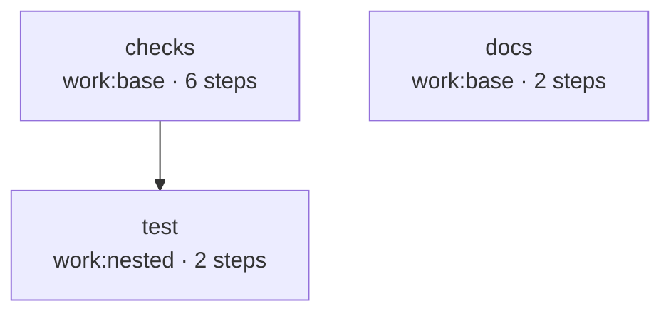

# Dogfooding: the engine checks itself

work is built with work. The repository ships a `.workflows/ci.yaml` that runs the
project's own static checks, full test suite, and docs build — every job in its own
gondolin micro-VM, on the same engine you run. (The AI agent code review is a
separate, on-demand workflow — see [Review](./review).)

It's a useful example precisely because it's real. The pipeline leans on the
features you'd reach for in your own workflows: reusable workflows composed with
`uses:`, a `needs` DAG that sequences jobs, and per-job VM isolation. The `test` job
goes furthest: it runs the engine's **own e2e suite in nested micro-VMs**, so `work`
exercises its VM layer with `work`, on one machine, no external CI (see
[test](#test-the-suite-runs-itself-nested)).

```bash
work run ci          # the whole pipeline, headless
work serve           # or watch it run in the console
```

## The pipeline at a glance

`ci` is a thin orchestrator. It composes three **reusable workflows** with job-level
`uses:`; one `needs` edge sequences `test` after `checks`, and `docs` runs in
parallel:

```yaml
# .workflows/ci.yaml
name: ci
jobs:
  checks:
    uses: workflow/checks      # lint / typecheck / knip + report-only fan-in, sloc
  test:
    needs: [checks]
    uses: workflow/test        # the full suite, in nested micro-VMs
  docs:
    uses: workflow/docs        # render the VitePress site so a markdown break fails here
```

A single `work run ci` inlines those into one flat DAG — the actual output of
`work graph ci --format mermaid`. Every box is a real job in its own micro-VM:



`checks` and `docs` start together; `test` waits on `checks` — no point booting the
heavy nested-VM job while the fast static tools might already be red. `docs` has its
own dependency tree and is independent of both, so it runs alongside. All three are
**hard gates**: any failure fails the run.

## checks: the static gate

`checks` runs the project's static tooling in one VM after a single `npm ci`. `lint`,
`typecheck`, and `knip` are **gates** — a failure fails the job and the whole `ci`
run, fast, at the first red tool. Two further steps, `fan-in` and `sloc`, are
**report-only**: they print structural numbers (afferent coupling; the SLOC
distribution) to the run log and always pass.

Each step also exposes the engine's built-in per-step verdict
(`success`/`failure`/`skipped`) via
[`steps.<id>.outcome`](../reference/workflow-syntax#step-context), surfaced as a job
output — no `$WORK_OUTPUT` plumbing, no LLM in the loop for "did it pass." The pass/fail
signal is already authoritative.

```yaml
# .workflows/checks.yaml
name: checks
on:
  workflow_call:
    outputs:
      lint: ${{ jobs.static.outputs.lint }}
      # …typecheck / knip / fanin / sloc likewise
jobs:
  static:
    outputs:
      lint: ${{ steps.lint.outcome }}        # the engine's pass/fail verdict
      # …typecheck / knip / fanin / sloc likewise
    steps:
      - name: install
        run: npm ci
      - id: lint
        name: lint
        run: npm run lint                     # a gate: a failure fails the job
      # …typecheck, knip — identical, one gate each
      - id: fanin
        name: fan-in
        run: npm run fan-in                   # report-only: always exits 0
      # …sloc likewise
```

::: info The same tools gate in GitHub Actions
`work run ci` is a real gate locally, and GitHub Actions
(`.github/workflows/ci.yml`) runs the same tools directly on every PR and push — the
enforced gate before merge. The dogfood pipeline isn't a toy reduction; it's the
engine running its own checks the way you'd run yours.
:::

## test: the suite runs itself, nested

`test` is the most pointed piece of dogfooding: it runs the **entire** test suite,
including the real-VM e2e tier, **self-hosted**. The job runs on `work:nested` (a
custom image that is just `work:base` plus `qemu-system-aarch64` and `qemu-img`), and
its `npm test` step boots the e2e examples in **nested gondolin micro-VMs**.

No special engine support is needed for the nesting. Inside a guest there's no
`/dev/kvm`, so gondolin's accelerator selection falls back to **TCG** (software
emulation) on its own. The inner VMs fetch their guest image once over the job's
egress and reuse it for the whole run. So `work` exercises its own VM layer
end-to-end (compile → boot → run a job in a VM) on one machine, no external CI:

```yaml
# .workflows/test.yaml
jobs:
  unit:
    runs-on: work:nested
    machine: { cpus: 8, memory: "64G" }   # the outer VM hosts the nested e2e VMs
    outputs:
      test: ${{ steps.test.outcome }}     # the engine's deterministic verdict
    steps:
      - run: npm ci
      - id: test
        env: { WORK_SKIP_VM: "", WORK_NESTED: "1" }
        run: npm test                      # a test failure fails the job — a hard gate
```

::: info Two honest caveats
- **It needs a roomy host.** The outer VM is sized to hold several 8 GB inner VMs at
  once (≈ 64 GB). Shrink the outer `machine:` and override the inner examples to
  smaller sizes to run on leaner hardware (at the cost of inner parallelism).
- **Two egress assertions skip when nested** (`WORK_NESTED=1`). The inner and outer
  VMs share gondolin's `192.168.127.0/24` guest subnet, so the egress test's on-box
  "model host" address collides between the layers. The secret-isolation contract is
  still verified on bare metal (host + GitHub Actions), and the core half — *the real
  key never enters the guest* — still runs nested.
:::

## docs: catch a markdown break before the deploy

`docs` renders the VitePress documentation site in a VM — `npm ci` then
`npm run docs:build`, each step `cd`-ing into `docs-site/` (its own dependency tree).
VitePress parses a double-curly expression as a Vue interpolation even inside
markdown, so a stray workflow expression in prose is a build error. Running the build
here makes that **fail the gate**, not the GitHub Pages deploy. It mirrors the GitHub
Actions `docs` job.

```yaml
# .workflows/docs.yaml
jobs:
  site:
    runs-on: work:base
    outputs:
      build: ${{ steps.build.outcome }}
    steps:
      - run: cd docs-site && npm ci
      - id: build
        run: cd docs-site && npm run docs:build   # a markdown break fails here
```

## What it exercises

Every part of the pipeline maps to a feature you can use directly:

| In the pipeline | Engine feature it leans on |
|---|---|
| `ci` → `checks` / `test` / `docs`, three reusables composed with `uses:` | [Reusable workflows](../guide/reusable-workflows) |
| `test` runs the full suite in nested gondolin VMs | [Custom images](../guide/custom-images) (`work:nested` bundles QEMU) + nested execution — TCG fallback, no `/dev/kvm` needed |
| `checks` / `test` / `docs` expose each step's `steps.<id>.outcome` as a job output | Deterministic per-step verdict threaded as job/workflow outputs across the `needs` DAG |
| `docs` renders VitePress in a VM | A markdown break fails the gate, not the Pages deploy |

## Run it yourself

The `ci` workflows live in
[`.workflows/`](https://github.com/nullbytelabs/work/tree/main/.workflows) —
`ci.yaml` and the three reusables it composes (`checks.yaml`, `test.yaml`,
`docs.yaml`). The deterministic gate needs no model.

```bash
work graph ci   # render the compiled DAG without running it
work run ci     # checks + test + docs (the deterministic gate)
```

From here, the [Reusable workflows](../guide/reusable-workflows) guide covers `uses:`
and output threading; [Review](./review) is the agentic counterpart to this gate (a
multi-agent code review, on demand); and once these runs emit traces, [Trace
analysis](./trace-analysis) feeds a run id back in to fetch and analyze its Tempo trace.
