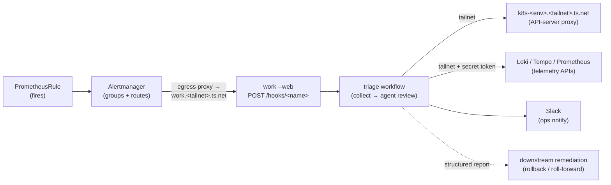

# Tailnet incident response: a cluster fleet on the tailnet, alerts as triggers

Research notes toward a fully autonomous incident-response loop built from
pieces that already exist: a fleet of Kubernetes clusters exposed on a
Tailscale tailnet, Prometheus alerting routed to a `work` instance's webhook
receiver, evidence-bound triage workflows, and structured hand-off to ops and
to downstream remediation automation. Claims about external systems are drawn
from official docs (URLs inline); anything not freshly confirmed is flagged
**UNVERIFIED — needs confirmation**.

The thesis: every hop of this loop — alert egress, webhook delivery, cluster
access, notification — can ride a private tailnet with identity-based auth,
and `work`'s existing webhook, `secrets:`, and egress surfaces already fit the
delivery semantics Alertmanager actually has.



## 1. The substrate: a fleet of clusters on the tailnet

The [Tailscale Kubernetes operator's API-server proxy](https://tailscale.com/kb/1437/kubernetes-operator-api-server-proxy)
makes each cluster a tailnet machine — `k8s-prod.<tailnet>.ts.net`,
`k8s-staging.<tailnet>.ts.net`, … In its default auth mode the proxy
authenticates the **dialing tailnet identity** and impersonates it to the API
server, with impersonation groups assigned through Tailscale ACL grants
(`tailscale.com/cap/kubernetes`); operators get a kubeconfig via
`tailscale configure kubeconfig <proxy-hostname>`. The kubeconfig carries no
bearer token — identity is the WireGuard connection (**UNVERIFIED** that the
generated kubeconfig is literally credential-free; inspect one).

For `work`, each cluster is then just a hostname a job dials —
`https://k8s-prod.<tailnet>.ts.net` — with no per-cluster config:

- **No token** — auth is the engine host's tailnet identity, evaluated by the
  in-cluster proxy per the grants. Nothing to mint, rotate, or leak.
- **TLS is publicly trusted** — the proxy serves a Let's Encrypt cert for its
  `ts.net` name, so the host-side `NODE_EXTRA_CA_CERTS` apparatus from the
  kind example drops out.
- **Least privilege lives in the grants, not the workflow.** The engine host
  should be a dedicated tagged machine whose grant maps to a read-only
  impersonation group (the moral equivalent of the kind example's
  `triage-bot`). Whatever that machine may do is the ceiling for every
  workflow run.

**The one engine gap:** tailnet addresses are CGNAT (`100.64.0.0/10`), which
the sandbox's internal-range block includes (see
[`egress-data-path.md`](egress-data-path.md), invariant 3). Open egress covers
*public* upstreams but never lifts that block, so reaching a tailnet host from a
job is still an open engineering question — the `allowedInternalHosts` plumbing
exists end-to-end in the target layer, but nothing wires it to a user-facing
grant. A name-based internal grant (lift the block for one named tailnet host,
no per-IP pinning) is the natural shape; the config field and the line that
forwards it are what's missing. This is the prerequisite for everything below.

## 2. The `work` instance on the tailnet

Run `work --web` on a dedicated tailnet machine — `work.<tailnet>.ts.net` —
fronted by [`tailscale serve`](https://tailscale.com/kb/1312/serve):

- The web server deliberately binds **loopback only, plain HTTP**; Serve
  terminates TLS with an auto-provisioned Let's Encrypt cert for the
  machine's `ts.net` name and proxies to the local port. Tailnet-only by
  default (Funnel is a separate opt-in and should stay off).
- The webhook receiver is already **tunnel-aware**: `POST /hooks/*` is exempt
  from the loopback Host check that protects the UI, carrying cryptographic
  auth (bearer/HMAC) instead (`src/web/server.ts`).
- Serve injects **identity headers** (`Tailscale-User-Login`, …) for the
  local backend and strips them from incoming requests, so they're
  unspoofable for tailnet traffic. The receiver doesn't read them today;
  they're a candidate defense-in-depth layer (assert the sender is the
  expected egress-proxy machine) on top of the per-hook secret.
- **Tailnet ACLs are the outer wall:** only the clusters' egress proxies and
  admin devices should be able to reach `work.<tailnet>.ts.net:443` at all.

Defense in depth, outermost-in: tailnet ACL → Serve TLS + identity headers →
per-hook bearer secret (constant-time verified, fail-closed) → workflow
`on: webhook` opt-in → read-only cluster grants (the engine host's tailnet
identity is the ceiling for every run).

## 3. Alert egress: cluster → tailnet → webhook

Alertmanager pods aren't on the tailnet, but the
[operator's cluster egress](https://tailscale.com/kb/1438/kubernetes-operator-cluster-egress)
bridges them: an `ExternalName` Service annotated
`tailscale.com/tailnet-fqdn: work.<tailnet>.ts.net` gets rewritten by the
operator to point at an egress proxy it manages (HA variant:
`tailscale.com/proxy-group`). Alertmanager's webhook URL is then ordinary
in-cluster service DNS, and delivery rides the tailnet end to end — the
receiver is never exposed to the internet or even to the VPC.

## 4. Routing: declarative, namespaced, GitOps-native

Two layers, both CRDs from
[prometheus-operator](https://prometheus-operator.dev/docs/developer/alerting/)
(typically deployed as part of the kube-prometheus-stack chart):

- **`PrometheusRule`** defines what fires (already per-team, per-namespace).
- **`AlertmanagerConfig`** (namespaced) defines where it goes: `route`
  matchers → a receiver with `webhookConfigs`. The operator merges these into
  the global Alertmanager config and **enforces a namespace matcher** on each
  — a team's routing only ever matches alerts labeled with its own namespace.

The receiver entry that targets `work`:

```yaml
receivers:
  - name: work-triage
    webhookConfigs:
      - url: "http://work-egress.monitoring.svc/hooks/prod-incident"
        httpConfig:
          authorization:            # Authorization: Bearer <secret>
            credentials:
              name: work-hook-secret
              key: token
```

Verified: Alertmanager's `webhook_config` supports a static bearer via
`http_config.authorization`
([configuration reference](https://prometheus.io/docs/alerting/latest/configuration/));
the CRD mirrors it with the credential from a same-namespace Secret
(**UNVERIFIED** — confirm `httpConfig.authorization` secretKeySelector shape
against the [API reference](https://prometheus-operator.dev/docs/api-reference/api/)).
Alertmanager **cannot HMAC-sign** webhook payloads natively — confirmed
absent — so `work` hooks for Alertmanager use `auth: "bearer"`, and payload
authenticity rests on bearer + tailnet transport rather than signatures.

So a hook per alert class, declaratively:

```json
"webhooks": {
  "prod-incident": {
    "workflow": "triage",
    "auth": "bearer",
    "secret": "$PROD_INCIDENT_HOOK_SECRET"
  }
}
```

**Declarative vs dynamic routing.** A single catch-all hook with one workflow
branching on `event` labels is tempting (the engine supports it — see §5), but
per-class hooks keep the routing legible: which alert class triggers which
workflow is a static, reviewable map rather than runtime branching. Recommendation:
declarative per-class (or per-cluster) hooks; dynamic branching only *within* a
class. (Cluster reach is governed one layer down by the engine host's read-only
tailnet identity, not by the hook — see §8 for splitting read-only triage from
write-capable remediation.)

**The whole routing surface is GitOps.** In a Flux/Argo shop,
`PrometheusRule` and `AlertmanagerConfig` are already PRs; Grafana dashboards
ride the same flow (the dashboard-ConfigMap sidecar pattern). The `work` side
is symmetric — triage workflows are `.workflows/*.yaml` and hook wiring is
the config's `webhooks` block — so "which alerts trigger which automated
response, with access to which clusters" is end-to-end reviewable, versioned
config. No imperative registration anywhere in the loop.

## 5. Payload → `event`: already aligned

Alertmanager posts a stable JSON object
([`version: "4"`](https://prometheus.io/docs/alerting/latest/configuration/#webhook_config)):
top-level `status` (`firing|resolved`), `groupKey`, `receiver`,
`groupLabels`, `commonLabels`, `commonAnnotations`, `externalURL`,
`truncatedAlerts`, and `alerts[]` each with `status`, `labels`,
`annotations`, `startsAt`, `endsAt`, `generatorURL`, `fingerprint`.

The receiver parses any JSON object into the `event` context, and the
expression engine already handles the shapes this needs — nested paths,
array indexing, compile-time interpolation in `run:`/`env:`/`with:`, and
runtime evaluation in `if:`/`when:` (the workflow-syntax docs' examples are
already Alertmanager-shaped):

```yaml
jobs:
  triage:
    if: ${{ event.status == 'firing' && event.commonLabels.severity == 'critical' }}
    steps:
      - run: |
          echo "alert: ${{ event.alerts[0].labels.alertname }}"
          echo "namespace: ${{ event.alerts[0].labels.namespace }}"
```

The fired labels (namespace, workload, alertname) parameterize the same
collect-then-analyze pattern as the k8s-triage example — `kubectl describe`,
logs, events for the implicated workload — so the agent reviews evidence
*about the thing that alerted*, gathered deterministically.

Sizing note: the receiver caps bodies at **256 KB**; set `max_alerts` on the
webhook config so grouped storms truncate (`truncatedAlerts` counts the
drops) instead of bouncing with 413.

## 6. Evidence beyond kubectl: the telemetry stack on the tailnet

An LGTM-style stack (Loki, Grafana, Tempo, Prometheus/Mimir — fed by
collection agents like Grafana Alloy, often through a central gateway) is a
set of token-authed HTTP APIs, which a step reaches by referencing its token
from the `secrets:` whitelist:

| Signal | API | Query language |
|---|---|---|
| Metrics | `/api/v1/query`, `/api/v1/query_range` | PromQL |
| Logs | `/loki/api/v1/query_range` | LogQL |
| Traces | `/api/search`, `/api/traces/<id>` | TraceQL |
| All of the above, brokered | Grafana `/api/ds/query` + service-account token | one token |

Expose each on the tailnet like everything else (the operator can front
individual in-cluster Services as tailnet machines). The token-less APIs need
no secret; for the tokened ones, put the service-account token in `work.json`'s
`secrets:` block (`"GRAFANA_TOKEN": "$GRAFANA_SERVICE_ACCOUNT_TOKEN"`) and a
collector step reads it as `${{ secrets.GRAFANA_TOKEN }}` in its `env:` — or
broker the whole stack through Grafana with a single service-account token.
Direct component APIs are the better fit for scripted collection: clean JSON
for `jq`, and `logcli`/`promtool` bake into a `work:lgtm` image the same way
kubectl bakes into `work:k8s`.

**This is the general case, not an enhancement.** A real fleet has VMs and
bare-metal reporting through on-host agents alongside the clusters. Alerts
about those hosts arrive through the same Alertmanager → webhook path, but
there is no API server to `kubectl describe` — telemetry queries are the
*only* evidence channel. kubectl is just the Kubernetes-specific collector;
LogQL/PromQL/TraceQL are the universal ones.

**Conditionals steer the diagnostic DAG.** The alert's labels and window
(`event.alerts[0].labels.*`, `startsAt`) parameterize which collectors run
at all:

```yaml
jobs:
  logs:      # crash-shaped alerts → logs around the firing window
    if: ${{ event.commonLabels.alertname =~ 'Crash|OOM|Restart' }}
    ...
  traces:    # latency-shaped alerts → exemplar traces + RED metrics
    if: ${{ event.commonLabels.signal == 'latency' }}
    ...
  describe:  # only when the alert names a Kubernetes workload
    if: ${{ event.commonLabels.namespace != '' }}
    ...
  diagnose:
    needs: [logs, traces, describe]   # fan-in; continue-on-error upstream
```

Each collector is a deterministic, time-windowed query; `continue-on-error`
lets partial evidence still reach the fan-in; the DAG **is** the diagnostic
runbook, reviewable in `work graph` and versioned like everything else.

**Scripts vs in-guest MCP.** There is no MCP surface in `work/agent` today
(the primitive is deliberately prompt-only), but the `secrets:` whitelist
already buys the interactive tier: reference `${{ secrets.GRAFANA_TOKEN }}` in
the diagnose job's `env:` and the agent can `curl` follow-up LogQL/PromQL
mid-analysis. Where you'd rather the agent never hold the token, keep the split
visible in the YAML: a `fetch` job holds the secret and runs the deterministic
collectors, exposing their results as job outputs; the diagnose agent
(`needs: [fetch]`) consumes `${{ needs.fetch.outputs.* }}` as pure evidence
analysis, with no secret in its scope. MCP-in-guest remains a possible future
`work/agent` extension if interactive tooling ever needs to be richer than curl.

## 7. Delivery semantics: at-least-once meets ack-fast

Alertmanager's delivery model (notifier retries on 429/5xx with backoff —
**UNVERIFIED**, from the notify package's code, not docs; plus re-notification
every `group_interval` while alerts still fire; `send_resolved` defaults
**true**) lands on a receiver that already speaks it:

| Alertmanager behavior | Receiver behavior today |
|---|---|
| Expects fast 2xx | **202 immediately**, run executes async |
| Retries on 429/5xx | **429 + `Retry-After: 5`** at capacity (4 concurrent / 100 queued, configurable) |
| May redeliver identical payloads | **SHA-256(hook + raw body) dedupe, 300 s TTL** → 200 with the original `runId` |
| Re-notifies every `group_interval` | New payload (timestamps differ) → **new run** |
| Sends `resolved` notifications | JSON like any other → reaches `event.status` |

Two policy gaps to research, both at the workflow layer rather than the
receiver:

- **Re-notification ≠ new incident.** A still-firing group re-delivers past
  the dedupe window and spawns another triage run. Options: tune
  `repeat_interval`/`group_interval` upstream; key a longer dedupe on
  `groupKey`; or make the workflow idempotent (first step checks for an open
  incident for this `groupKey` and short-circuits). The last is the most
  honest — incident identity is a domain concept, not a transport one.
- **Resolved as a first-class event.** Either gate with
  `if: ${{ event.status == 'firing' }}` and drop resolutions, or route
  `resolved` to a small close-the-loop workflow (post the all-clear to the
  same Slack thread, close the incident record). The latter is what makes the
  loop feel autonomous rather than fire-and-forget.

Every delivery — accepted, deduped, 401/403, shed at capacity — is journaled
to the receiver's durable audit log with timestamp, result, status, run id,
and source IP, which is the paper trail an autonomous loop needs anyway.

## 8. Closing the loop: ops and remediation

- **Slack is just another tokened API.** `chat.postMessage` with the bot token
  from `secrets:` (`"SLACK_BOT_TOKEN": "$SLACK_BOT_TOKEN"`), read as
  `${{ secrets.SLACK_BOT_TOKEN }}` in a deterministic `run:` step's `env:`. The
  notify step is a plain `run:` job, not the agent, so the token never reaches
  the model; the diagnose job's report step posts the incident review, and the
  resolved-path workflow posts the all-clear.
- **Remediation is a hand-off, not a privilege escalation.** The triage run
  ends by POSTing its structured report (workload, failure, root cause,
  evidence, recommended fix) to a downstream automation — a code-change agent
  that can open a rollback or roll-forward PR. Deliberate properties:
  - The triage side stays **read-only by construction** (cluster grants);
    the remediation channel is a separate system with its own auth and its
    own approval posture.
  - The contract between them is the **report schema**, not shared access —
    the triage engine never holds write credentials, the remediation side
    never reads clusters directly.
  - Phasing: notify-only → fix-suggested-in-report → auto-remediate for
    narrow, well-understood alert classes (the ConfigMap-key-mismatch kind),
    each phase earning the next with its track record.

### Gated in-engine remediation: agent decides, parser gates, determinism acts

The first remediation class small enough to live *inside* a workflow — a
`rollout restart` of a known-flaky deployment, say — doesn't need the
external hand-off. The engine's existing pieces compose into a guarded
action path, with one rule doing the heavy lifting: **the model's free text
is never the API.** The agent renders a verdict; a deterministic step you
wrote produces the boolean that actually gates anything:

```yaml
diagnose:
  outputs:
    restart:   ${{ steps.gate.outputs.restart }}
    namespace: ${{ steps.gate.outputs.namespace }}
    name:      ${{ steps.gate.outputs.name }}
  steps:
    - id: sre
      uses: work/agent
      with: { prompt: "…end with exactly: RESTART: yes|no / WORKLOAD: <ns>/<name>" }
    - id: gate     # strict parse + allowlist; writes key=value to $WORK_OUTPUT
      env: { VERDICT: "${{ steps.sre.outputs.output }}" }
      run: ./parse-verdict.sh   # restart=true only on exact format AND allowlisted workload

remediate:
  needs: [diagnose]
  if: ${{ needs.diagnose.outputs.restart == 'true' }}
  uses: ./restart-deployment.yaml         # reusable workflow, typed inputs
  with:
    namespace: ${{ needs.diagnose.outputs.namespace }}
    name:      ${{ needs.diagnose.outputs.name }}
```

All engine-supported today: `if:`/`when:` read `needs.<job>.outputs.<key>`
(outputs are strings — compare `== 'true'`); `run:` steps emit outputs as
`key=value` lines to `$WORK_OUTPUT`; a reusable job's `with:` accepts runtime
`needs.*` outputs validated against the callee's typed inputs. The gate step
is where policy lives — exact-format match plus an allowlist of workloads
that are *ever* auto-restartable — so a confused agent can recommend anything
and the worst case is `restart=false`.

**Two credentials, by necessity.** The API-server proxy's identity auth is
per-*machine*: every job from the engine host shares one tailnet identity, so
read-only triage and write-capable remediation can't be split by identity
alone. Keep the host's grant read-only (the ceiling for everything), and give
the `remediate` workflow a separate write token via `secrets:` — a dedicated
ServiceAccount whose RBAC is exactly `patch` on `deployments` (all a rollout
restart needs), short-lived, referenced only by the `remediate` job's `run:`
step. The agent job never references it: the thing that thinks can't act, and the
thing that acts can't think.

Nothing in the loop transits the public internet: alert egress, webhook
delivery, cluster reads, and the remediation hand-off (if it's also a tailnet
service) all stay inside the tailnet's ACLs.

## 9. Open items

1. **Name-based internal-host grant** — the prerequisite for reaching tailnet
   (CGNAT) hosts from a job; the `allowedInternalHosts` plumbing exists in the
   target layer, but a user-facing config field and the line that forwards it
   are needed (plus tests, docs).
2. Verify the flagged claims: Alertmanager retry semantics (notify package)
   and the version that introduced `http_config.authorization` (believed
   0.22.0); `AlertmanagerConfig` `httpConfig.authorization` field shape; the
   Tailscale `kubernetes` capability grant JSON; the generated kubeconfig's
   contents.
3. Incident identity: dedupe-by-`groupKey` vs workflow-level open-incident
   check — pick one and codify.
4. Deployment story for the `work` machine: tagged node, systemd unit,
   `tailscale serve` config, and the read-only impersonation grant as the
   single security lever.
5. Identity-header verification in the receiver (assert expected sender
   machine) as cheap defense-in-depth.
6. The structured report contract for the remediation hand-off — versioned
   schema, same rigor as the Alertmanager payload it mirrors.
